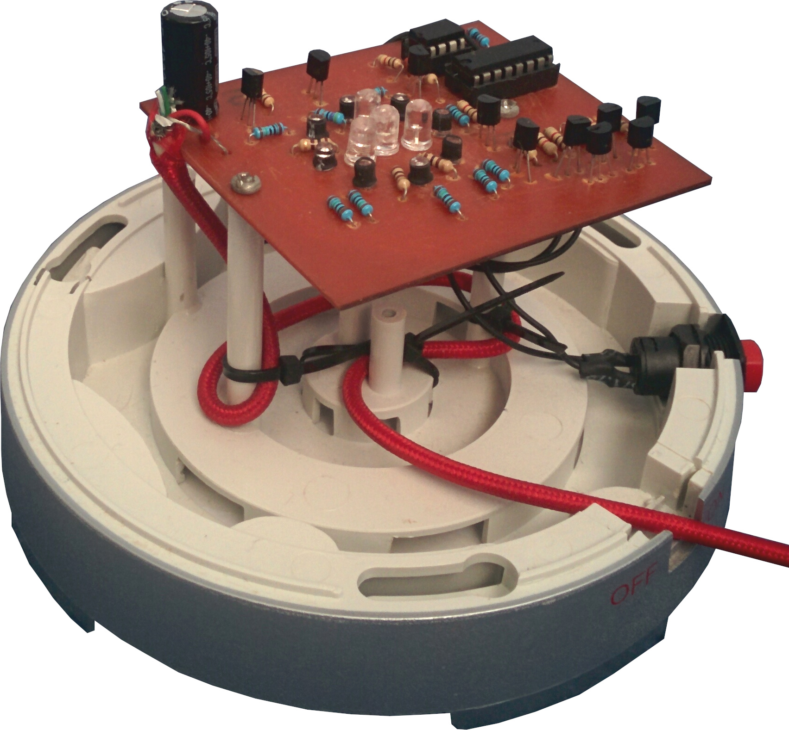

# 'ey up!

## Introduction
This repository contains files from a personal project. The aim was to create a small microcontroller-driven LED module to replace a broken incandescent bulb from a fibre optic Christmas tree. This is my first project involving PIC microcontrollers, and the second PCB I've designed; mistakes and uncommon design techniques are to be expected.

Feel free to re-use or modify this project to fit your needs, or use as a reference for PCB design or PIC software development.

## Outcome

## Components
The following is a summary of the components used:
- A single [**PIC12F683**](https://www.microchip.com/wwwproducts/en/PIC12F683) microcontroller to control and manage the visual animations, as well as receiving user input
- A [**74HC595**](http://www.ti.com/lit/ds/symlink/sn74hc595.pdf) 8-bit shift register, which individually controls the 8 outer blue LEDs
- 8x 3mm blue LEDs for the outer ring
- 3x 5mm green LEDs for the inner ring (PWM/brightness driven)
- 1x 5mm white LED to add short flashing/flicker effects
- 10x [**2N3904**](https://www.onsemi.com/pub/Collateral/2N3903-D.PDF) NPN transistors to drive each set of LED (8x blue + 1x green + 1x white)
- 1x SPST momentary switch to allow the user to change the displayed colour or animation
- Bunch of resistors to limit the current for the transistors & LEDs
- A 1000μF (rated 25V) electrolytic capacitor on the input, and a small 100nF ceramic decoupling capacitor adjacent to the microcontroller power pins

## Design constraints
There were various constraints throughout this project, the most difficult one being that I could only produce a single-sided PCB, making overlaps impossible without using space for a 0Ω link. The size of the board was also restricted to *68mm x 92mm*, otherwise the module wouldn't fit into the tree's current plastic base housing. Drill holes also had to be made and inserted at defined locations so the board could easily be screwed into the unit using pre-existing screw mounts from the previous incandescent arrangement.